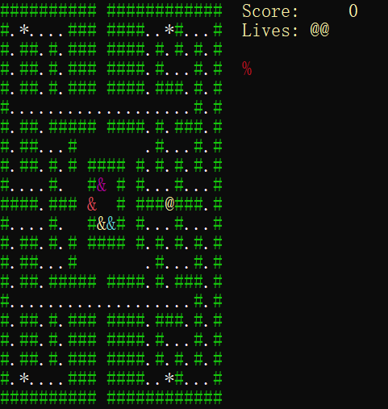

# Terminal Maze Chase 🎮

> **ARCHIVED REPOSITORY**: This repository has been renamed to **Terminal-Maze-Chase** and is now archived. It is no longer actively maintained.

## ⚠️ Disclaimer / Legal Notes
This is a fan-made, educational project only. It is not affiliated with, endorsed, or sponsored by Bandai Namco Entertainment Inc. Pac-Man™ is a registered trademark of Bandai Namco Entertainment Inc. All rights belong to their respective owners.

This implementation is **for demonstration and learning purposes only**, and is not intended for commercial use or redistribution.

---

## Overview

A classic Pac-Man-style maze chase game implemented in VB.NET, designed to run entirely in your terminal! Navigate through a neon green maze, collect pellets, avoid ghosts, and survive as long as you can.



## Features

- 🎯 **Classic Gameplay**: Navigate through the maze, collect pellets, and avoid ghosts
- ⚡ **Power Pellets**: Turn the tables on ghosts temporarily
- 📈 **Level Progression**: 7 levels of increasing difficulty
- 🖥️ **Terminal-Based**: No graphics required - pure text-based fun
- 🧠 **Advanced AI**: Ghosts use A* pathfinding for intelligent chasing
- 🏆 **Score Tracking**: Keep track of your high score and lives

## Getting Started

### Prerequisites
- **.NET SDK 8.0** or later
- A terminal that supports ANSI color codes

### Installation

```bash
git clone https://github.com/Pac-Dessert1436/Terminal-Maze-Chase.git
cd Terminal-Maze-Chase
dotnet run
```

Or open the project in Visual Studio and run it directly.

## Controls

| Key | Action |
|-----|--------|
| ↑ | Move Up |
| ↓ | Move Down |
| ← | Move Left |
| → | Move Right |
| Enter | Start Game |

## Gameplay Mechanics

### Player (`@`)
- Collect pellets (`.`) for 10 points each
- Eat power pellets (`*`) for 50 points to turn ghosts scared
- Catch cherries (`%`) for bonus points (100 + 200 × level)
- Avoid ghosts (`&`) at all costs!

### Ghosts (`&`)
- **Red Ghost**: Aggressively chases the player
- **Magenta Ghost**: Targets 4 tiles ahead of player movement
- **Cyan Ghost**: Uses ambush strategy from behind
- **Yellow Ghost**: Random movement pattern
- When scared (blue), ghosts flee from the player

### Scoring System

| Item | Points |
|------|--------|
| Pellet (`.`) | 10 |
| Power Pellet (`*`) | 50 |
| Ghost (when scared) | 200, 400, 800, 1600... |
| Cherry (`%`) | 100 + 200 × level |

### Lives
- Start with 3 lives
- Earn an extra life at 10,000 points
- Game ends when lives reach 0 or all 7 levels are completed

## Code Structure

```
Program.vb
├── Program Module            # Main game loop and logic
│   ├── Main()                # Entry point
│   ├── GameplayProcess()     # Core game mechanics
│   └── DisplayTitleScreen()  # Display game title screen
├── GridIndex Structure       # 2D coordinate system
└── AStarAlgorithm Class      # Pathfinding for ghosts
```

## Technical Details

### A* Pathfinding Algorithm
The ghost AI uses an optimized A* algorithm with:
- Manhattan distance heuristic for better performance
- Priority queue for efficient open list management
- Dictionary-based g-score tracking

### Ghost Behavior
Each ghost has unique targeting behavior:
- **Blinky (Red)**: Directly chases the player
- **Pinky (Magenta)**: Aims 4 tiles ahead of player's direction
- **Inky (Cyan)**: Uses Blinky's position to create ambush paths
- **Clyde (Yellow)**: Random movement for unpredictability

## License

This project is licensed under the MIT License. See the [LICENSE](LICENSE) file for details.

---

_🎮 Happy maze chasing!_